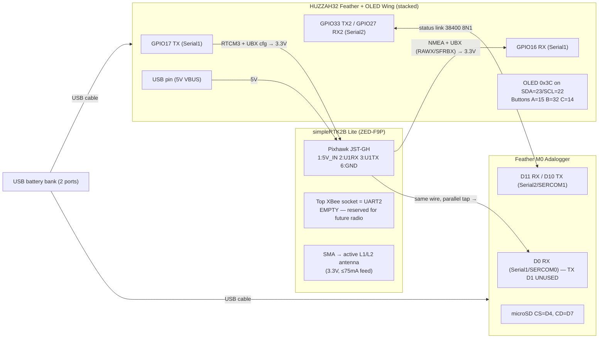

# Full-System Wiring — Topology B (shared-listener UART tap)

**Topology decision:** ArduSimple's simpleRTK2B Lite documentation exposes
**no I2C (SDA/SCL) pads** — the only documented special-function pins are
TIMEPULSE, RTK_STAT, and GEOFENCE
([hookup guide](https://www.ardusimple.com/simplertk2blite-hookup-guide/)).
Topology A (M0 on F9P I2C) is therefore off the table; we build
**Topology B**: F9P UART1 TX fans out to both Feathers, UART1 RX is driven
only by the HUZZAH32. *Residual check:* photo-verify the physical board for
any unlabeled SDA/SCL pad anyway (`QUESTIONS.md` Q3) — the doc sweep was
done through search extraction and can't 100 % exclude an undocumented pad.

**Critical vendor fact discovered during verification:** the Lite has **no
native USB**. The included XBee-to-USB adapter reaches the F9P through the
Lite's bottom XBee header, which carries **UART1 via an FTDI converter**
([hookup guide](https://www.ardusimple.com/simplertk2blite-hookup-guide/),
[ArduSimple Q&A](https://www.ardusimple.com/question/xbee-to-usb-adapter-connection-to-simplertk2blite/)).
So the Pixhawk JST connector, the bottom XBee header, and "USB/u-center"
are **all the same F9P port**. Consequence: **never** run u-center via the
USB adapter while the HUZZAH32 TX wire is attached — two drivers on F9P
UART1 RX. See the bench rule below.

## System diagram

## Wire list (every conductor)

| # | From | To | Signal | Direction | Level |
|---|---|---|---|---|---|
| 1 | HUZZAH32 `USB` pin | Lite JST **pin 1** (5V_IN) | power, 5 V from VBUS | → Lite | 5 V (Lite accepts 4.5–5.5 V) |
| 2 | HUZZAH32 **GPIO17** (header `TX`) | Lite JST **pin 2** (ZED-F9P UART1 **RX**) | RTCM3 corrections + UBX config | → F9P | 3.3 V |
| 3 | Lite JST **pin 3** (ZED-F9P UART1 **TX**) | HUZZAH32 **GPIO16** (header `RX`) **and, in parallel,** M0 **D0** (`RX`) | NMEA + UBX (RAWX/SFRBX/TIM-TM2) | F9P → both listeners | 3.3 V |
| 4 | Lite JST **pin 6** (GND) | HUZZAH32 `GND` | ground | — | 0 V |
| 5 | HUZZAH32 **GPIO33** | M0 **D11** | status link: time sync, log start/stop, shutdown | ESP32 → M0 | 3.3 V |
| 6 | M0 **D10** | HUZZAH32 **GPIO27** | status link: logging state, file, bytes, SD free | M0 → ESP32 | 3.3 V |
| 7 | M0 `GND` | HUZZAH32 `GND` | ground (do **not** rely on the bank's internal common) | — | 0 V |
| 8 | OLED FeatherWing | stacked on HUZZAH32 | I2C 0x3C on SDA=GPIO23 / SCL=GPIO22, 3V3, GND, buttons 15/32/14 | — | 3.3 V |

JST pin naming is **from the F9P's perspective** — pin 2 "UART1 RX" is the
F9P's *input* (wire the ESP32 TX there); pins 4/5 are not connected
([hookup guide](https://www.ardusimple.com/simplertk2blite-hookup-guide/)).
Pin 1 is marked with a white square / "1" on the PCB; **never trust wire
colors on JST-GH pigtails**
([ArduSimple Pixhawk cable notes](https://www.ardusimple.com/product/pixhawk-cable-set/)).

Wire 3 is the **parallel tap**: one solder joint or 3-way splice near the
JST pigtail, two RX listeners on one F9P TX driver. Two 3.3 V CMOS inputs
over < 20 cm is a trivial load — no buffer needed.

## NEVER-connect list (tap discipline — one driver per line)

1. **M0 D1 (Serial1 TX): leave unconnected, always.** The F9P UART1 RX
   line's only driver is HUZZAH32 GPIO17.
2. **XBee-to-USB adapter + JST simultaneously.** The adapter's FTDI is
   another UART1 driver. u-center sessions happen with the JST pigtail
   unplugged (or at minimum wire 2 detached). Power-wise, multiple supplies
   are sanctioned by ArduSimple ("connect the three simultaneously —
   there's no risk", [hookup guide](https://www.ardusimple.com/simplertk2blite-hookup-guide/));
   the prohibition here is **data contention**, not power.
3. **Top XBee socket stays empty** — UART2 is reserved for the future
   radio; no firmware function may depend on it.
4. **Lite must never be powered from a Feather 3V3 pin** (see `power.md` —
   the HUZZAH32's AP2112 has ~250 mA headroom; the Lite + active antenna
   need ~200 mA, zero margin under WiFi TX spikes).
5. Nothing else on the HUZZAH32 I2C bus besides the stacked Wing (bus
   stays short; the HUZZAH32 has **no onboard I2C pullups**
   ([Adafruit pinouts](https://learn.adafruit.com/adafruit-huzzah32-esp32-feather/pinouts))
   — the Wing provides them; if the bus misbehaves, verify pullups to 3V3
   with a meter before adding 4.7–10 kΩ).

## Pin budget notes

- **HUZZAH32 Serial1 = GPIO17/16** is the Arduino-variant default
  ([pins_arduino.h](https://github.com/espressif/arduino-esp32/blob/master/variants/feather_esp32/pins_arduino.h)).
  **Serial2 is remapped via the GPIO matrix** to RX=27/TX=33
  (`Serial2.begin(38400, SERIAL_8N1, 27, 33)`): both are free header pins,
  not input-only (34/36/39), not strapping-sensitive (12), not OLED buttons
  (15/32/14), not I2C/LED (22/23/13).
- **M0 Serial2 = SERCOM1**, the Adafruit-documented recipe
  ([SERCOM guide](https://learn.adafruit.com/using-atsamd21-sercom-to-add-more-spi-i2c-serial-ports/creating-a-new-serial)):
  `Uart Serial2(&sercom1, 11, 10, SERCOM_RX_PAD_0, UART_TX_PAD_2);` with
  `void SERCOM1_Handler() { Serial2.IrqHandler(); }` and
  `pinPeripheral(10, PIO_SERCOM); pinPeripheral(11, PIO_SERCOM);` after
  `begin()`. Pad map: D10=PA18=SERCOM1.2 (TX pad 2), D11=PA16=SERCOM1.0
  (RX pad 0) — **mux C (`PIO_SERCOM`), not ALT** (ALT would grab SERCOM3 =
  I2C). SERCOM budget on this variant: 0=Serial1(D0/D1), 3=Wire(D20/D21),
  4=SPI/SD, 5=claimed by the core's hidden `Serial5` (its handler is
  already defined — don't collide); **free: SERCOM1, SERCOM2**
  ([variant.cpp](https://github.com/adafruit/ArduinoCore-samd/blob/master/variants/feather_m0/variant.cpp)).
- An unpowered listener loads the shared TX line through its protection
  diodes — **power both Feathers together** (same bank, both ports). See
  `power.md` sequencing.
